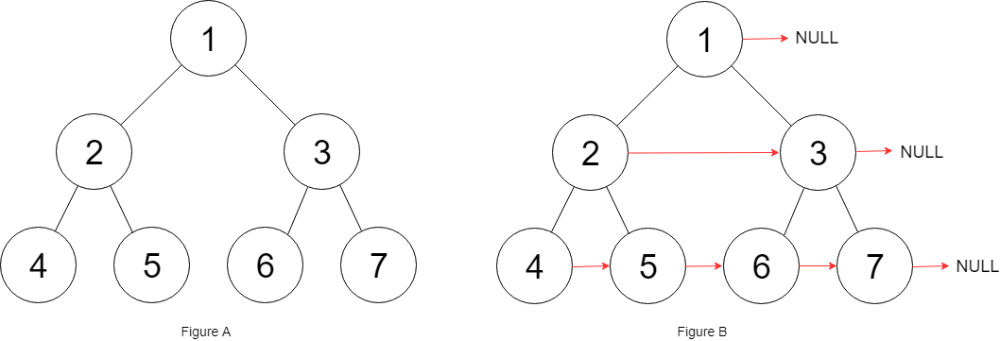

# [116. Populating Next Right Pointers in Each Node](https://leetcode.com/problems/populating-next-right-pointers-in-each-node/description/)

Observe the pattern in the following image:

Notice two things:
1. node.left.next = node.right 
2. node.right.next = node.next.left IF node.next is not None

Create the dfs function. 