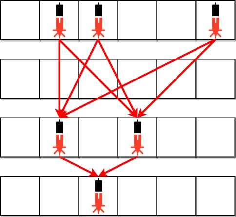

# [2125. Number of Laser Beams in a Bank](https://leetcode.com/problems/number-of-laser-beams-in-a-bank/description/?envType=daily-question&envId=2024-01-03)

The pattern is the sum of (number of lasers in current row * number of lasers in previous row), excluding the rows where the number of lasers is zero. 

In the example above, the answer will be (3 * 2) + (2 * 1) = 8
