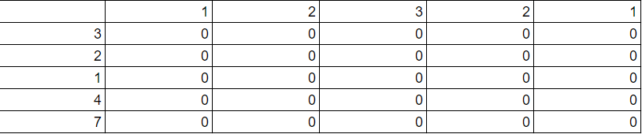
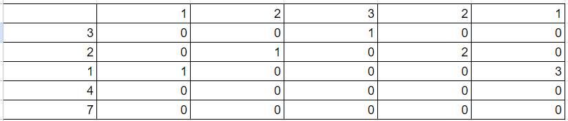

# [178 Maximum Length of Repeated Subarray](https://leetcode.com/problems/maximum-length-of-repeated-subarray/description/)

Solve using 2D dynamic programming. Create a 2D matrix, where the row is nums1 and the column is num2. 

Then, initialize all the cells to 0. In this case, nums1 = [1, 2, 3, 2, 1] and nums2 = [3, 2, 1, 4, 7]

Iterate through the matrix. If nums1[i] == nums2[j], then dp[j][i] = 1 + dp[j - 1][i - 1]. Be sure to add an if-statement to ensure that you don't go out of bounds. While calculating the value of each cell, also calculate the value of the maximum subarray length. 

The final matrix should look like this:

 